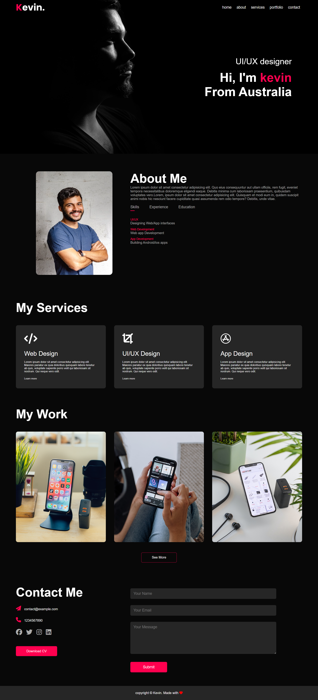

# Portfolio Website README 

## Overview
This README file provides instructions and information for setting up and customizing a simple portfolio website.
## Screenshots
 

## Features
- Clean and minimalist design
- Responsive layout for various devices
- Sections for about, portfolio/projects, and contact information

## Prerequisites
- Basic knowledge of HTML, CSS, and optionally JavaScript
- A text editor (e.g., Visual Studio Code, Sublime Text)
- A web browser (e.g., Chrome, Firefox)
- A hosting service (e.g., GitHub Pages, Netlify)

## Setup Instructions
1. Download or clone the repository to your local machine.
2. Navigate to the project directory.
3. Open the `index.html` file in a text editor.
4. Customize the content within the HTML tags to reflect your personal information, portfolio items, and contact details.
5. Save the changes made to the `index.html` file.
6. If necessary, modify the styles in the `styles.css` file to match your preferences.
7. Save the changes made to the `styles.css` file.
8. Optionally, customize the JavaScript functionality in the `script.js` file to add interactivity or additional features.
9. Save the changes made to the `script.js` file.
10. Open the `index.html` file in a web browser to preview your portfolio website locally.
11. Once satisfied with the changes, upload the entire project directory to your chosen hosting service.

## Customization Tips
- Replace the placeholder text and images with your own content.
- Add or remove sections in the `index.html` file as needed.
- Experiment with different fonts, colors, and layout options in the `styles.css` file to achieve the desired look.
- Extend the functionality by incorporating additional JavaScript features such as form validation or dynamic content loading.

## Resources
- [HTML Tutorial](https://www.w3schools.com/html/)
- [CSS Tutorial](https://www.w3schools.com/css/)
- [JavaScript Tutorial](https://www.w3schools.com/js/)

## Credits
This project template was created by Irfan.

## License
This project is licensed under the MIT License. See the `LICENSE` file for more details.

## Feedback and Support
For any questions, feedback, or support, please contact [irfanamohd0525@gmail.com].

## Version History
- v1.0 (Date): Initial release.
